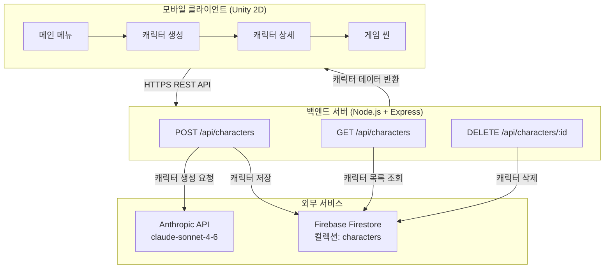

# 아키텍처 설계

## 전체 시스템 구성



---

## 컴포넌트별 상세 설계

### 1. 모바일 클라이언트 (Unity 2D)

```
Assets/
├── Scenes/
│   ├── MainMenu.unity           # 저장된 캐릭터 목록
│   ├── CharacterCreation.unity  # 캐릭터 생성 입력 화면
│   ├── CharacterDetail.unity    # 생성 결과 상세 화면
│   └── GameScene.unity          # 텍스트 기반 전투 씬
├── Scripts/
│   ├── UI/
│   │   ├── CharacterCreationUI.cs   # 외형/무기/컨셉 입력 폼
│   │   ├── CharacterDetailUI.cs     # 스탯/능력/스토리 표시
│   │   ├── CharacterListUI.cs       # 캐릭터 목록 표시
│   │   └── LoadingUI.cs             # 로딩 인디케이터
│   ├── Network/
│   │   └── ApiClient.cs             # 백엔드 REST API 호출
│   ├── Game/
│   │   ├── BattleManager.cs         # 전투 턴 관리
│   │   ├── CombatSystem.cs          # 데미지 계산 로직
│   │   ├── BattleLogUI.cs           # 전투 텍스트 로그 출력
│   │   └── EnemyData.cs             # 적 캐릭터 스탯 정의
│   └── Models/
│       └── CharacterData.cs         # 캐릭터 데이터 구조체
└── Prefabs/
    └── CharacterCard.prefab         # 목록용 카드 UI 프리팹
```

### 2. 백엔드 서버 (Node.js + Express)

```
backend/
├── src/
│   ├── routes/
│   │   └── characters.js        # /api/characters 라우트 정의
│   ├── services/
│   │   ├── claudeService.js     # Claude API 호출 및 프롬프트 관리
│   │   └── firebaseService.js   # Firestore CRUD 작업
│   ├── middleware/
│   │   └── errorHandler.js      # 전역 에러 처리
│   └── app.js                   # Express 앱 설정 (CORS, 라우트)
├── .env.example
└── package.json
```

---

## 데이터 모델

### Firestore — `characters` 컬렉션

```js
// 문서 구조 (자동 생성 ID 사용)
{
  id: "auto-generated-id",
  userInput: {
    appearance: "검은 머리, 키 크고 우아함",
    weapon: "지팡이",
    concept: "신중하고 차분한 마법사"
  },
  generated: {
    name: "실바나 아쉬크로프트",    // AI가 생성한 캐릭터명
    stats: {
      hp: 85,
      atk: 35,
      def: 25,
      mp: 120
    },
    abilities: [
      { name: "정적의 화살", description: "MP 20 소모. ATK×1.8 피해..." },
      { name: "마나 방벽",   description: "MP 30 소모. 다음 공격 무효화..." }
    ],
    story: "오래된 숲의 끝자락에서..."
  },
  createdAt: Timestamp
}
```

---

## API 명세

### POST /api/characters

유저 입력을 Claude API로 분석해 캐릭터를 생성하고 Firestore에 저장합니다.

**Request Body:**
```json
{
  "appearance": "검은 머리, 키 크고 우아함",
  "weapon": "지팡이",
  "concept": "신중하고 차분한 마법사"
}
```

**Response (200):**
```json
{
  "success": true,
  "data": {
    "id": "firestore-doc-id",
    "generated": {
      "name": "실바나 아쉬크로프트",
      "stats": { "hp": 85, "atk": 35, "def": 25, "mp": 120 },
      "abilities": [
        { "name": "정적의 화살", "description": "MP 20 소모. ATK×1.8 피해..." }
      ],
      "story": "오래된 숲의 끝자락에서..."
    },
    "createdAt": "2026-05-04T12:00:00Z"
  }
}
```

### GET /api/characters

Firestore에 저장된 전체 캐릭터 목록을 반환합니다.

**Response (200):**
```json
{
  "success": true,
  "data": [
    {
      "id": "doc-id",
      "name": "실바나 아쉬크로프트",
      "weapon": "지팡이",
      "concept": "신중하고 차분한 마법사",
      "createdAt": "2026-05-04T12:00:00Z"
    }
  ]
}
```

### GET /api/characters/:id

특정 캐릭터의 전체 정보를 반환합니다.

### DELETE /api/characters/:id

특정 캐릭터를 Firestore에서 삭제합니다.

---

## AI 프롬프트 설계

### Claude — 캐릭터 생성 프롬프트

```
시스템 프롬프트 (cache_control으로 캐싱됨):
  당신은 RPG 게임의 캐릭터 크리에이터입니다.
  유저가 제공한 외형, 무기, 컨셉 정보를 바탕으로
  해당 캐릭터에 어울리는 이름, 스탯, 특수능력, 배경 스토리를 생성합니다.

  규칙:
  - 캐릭터명은 컨셉과 어울리는 고유한 이름을 지어야 한다
  - 스탯 범위: HP 50~200, ATK 10~100, DEF 5~80, MP 0~150
  - 스탯은 무기와 컨셉에 논리적으로 연관되어야 한다
  - 특수능력은 1~3개, 각 능력은 이름과 효과(MP 소모량 포함)를 명시
  - 반드시 유효한 JSON만 반환하고 다른 텍스트는 포함하지 않는다

유저 메시지:
  외형: {appearance}
  무기: {weapon}
  컨셉: {concept}
```

---

## 데이터 흐름

```
유저 입력 (외형, 무기, 컨셉)
  │
  ▼
POST /api/characters
  │
  ├─► claudeService.generateCharacter(input)
  │     ├─► 시스템 프롬프트 (캐시됨)
  │     └─► Anthropic API 호출
  │           └─► JSON 파싱 → name, stats, abilities, story
  │
  ├─► firebaseService.saveCharacter(data)
  │     └─► Firestore `characters` 컬렉션에 문서 저장
  │
  └─► 클라이언트에 완성된 캐릭터 데이터 반환
        │
        ▼
      Unity: 캐릭터 상세 화면 표시
        │
        ▼
      "게임 시작" → GameScene 로드 → 텍스트 기반 전투
```

---

## 기술 결정 사항

| 결정 | 선택 | 이유 |
|------|------|------|
| 게임 엔진 | Unity 2D | 모바일 빌드 성숙도, C# 생태계 |
| 백엔드 | Node.js + Express | AI API 호출 중심의 비동기 I/O에 적합 |
| 데이터베이스 | Firebase Firestore | 설정 간단, 실시간 동기화, 무료 티어 충분 |
| AI 모델 | claude-sonnet-4-6 | 속도·품질·비용 균형, 한국어 이해 우수 |
| 게임 표현 방식 | 텍스트 기반 | 이미지 생성 비용 없음, 개발 복잡도 감소 |
| API 키 관리 | 백엔드 서버 격리 | Claude/Firebase 키를 클라이언트에 노출하지 않음 |
